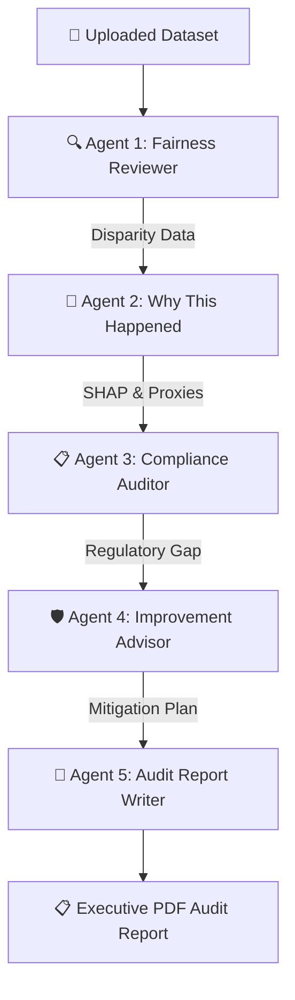
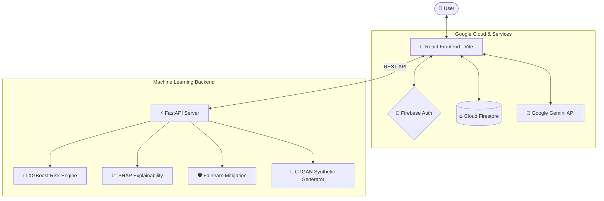

<div align="center">

# 🔍 FairLens AI

### Responsible AI Governance, Fairness Auditing & Bias Mitigation Platform

[](https://developers.google.com/community/gdsc-solution-challenge)
[](https://fairlens-ai-8d166.web.app)
[](https://react.dev)
[](https://fastapi.tiangolo.com)
[](https://ai.google.dev)
[](https://huggingface.co/spaces)

**An enterprise-grade, plain-English platform for auditing algorithmic bias, simulating policy impacts, generating synthetic data, and enforcing compliance across AI systems.**

[🚀 Live Demo](https://fairlens-ai-8d166.web.app) · [📋 Features](#-core-modules) · [🏗 Architecture](#-architecture) · [🛠 Setup Guide](#-getting-started)

---

</div>

## 📋 Table of Contents

- [💡 Problem & Mission](#-problem--mission)
- [✨ Core Modules (20 Advanced Features)](#-core-modules)
- [🧠 LangGraph-Powered Multi-Agent Auditor](#-multi-agent-ai-auditor)
- [📖 Plain-English Translation System](#-plain-english-translation-system)
- [🏗 Architecture](#-architecture)
- [🛠 Getting Started](#-getting-started)
  - [Frontend Development (React + Vite)](#frontend-development-react--vite)
  - [Backend Development (FastAPI + ML Stack)](#backend-development-fastapi--ml-stack)
- [🐳 Docker & Hugging Face Deployment](#-docker--hugging-face-deployment)
- [🌐 Google Technologies Used](#-google-technologies-used)
- [🌍 UN SDG Alignment](#-un-sdg-alignment)
- [📁 Project Structure](#-project-structure)
- [👥 Team — Boolean Bandits](#-team--boolean-bandits)

---

## 💡 Problem & Mission

> **Algorithmic bias** creates profound real-world harms—from discriminatory hiring algorithms screening out candidates based on gender or ethnicity, to biased credit scoring systems rejecting qualified applicants. 

Most organizations **lack the tools** to detect and address these issues prior to model deployment. Furthermore, existing fairness frameworks are highly technical, burying vital insights in mathematical jargon (such as *demographic parity* or *counterfactual metrics*) that compliance officers, business leaders, and HR professionals cannot understand.

**FairLens AI** bridges this gap. It is designed to look and feel like **Google Search Console** or **Grammarly**—abstracting complex data science metrics into clear, actionable, and visually stunning corporate governance dashboards, enabling both developers and non-technical stakeholders to build trust in AI.

---

## ✨ Core Modules

FairLens AI is structured into **20 advanced modules** categorized across five key dimensions of responsible AI management:

```
┌─────────────────────────────────────────────────────────────────────────────┐
│                                 FAIRLENS AI                                 │
├───────────────────┬────────────────────────┬────────────────────────────────┤
│ 📊 GOVERNANCE     │ 🔍 ANALYSIS            │ 🧪 SIMULATION & MITIGATION     │
│  - Gov. Dashboard │  - Nutrition Label     │  - Digital Twin                │
│  - Compliance     │  - Why This Happened   │  - What-If Simulator           │
│  - Alert Center   │  - Consistency Check   │  - Auto-Improvement            │
│  - Certifications │  - Relationship Map    │  - Smart Data Generator        │
│  - Timeline       │  - Intersectional Bias │  - Comparison Studio           │
│  - Safety Gate    │  - Auto-Scan Heatmap   │  - Real-Time Live Monitoring   │
└───────────────────┴────────────────────────┴────────────────────────────────┘
```

### 1. Governance & Dashboarding
*   **Fairness Governance Dashboard:** A high-level overview showing the organization's overall Fairness Health Score, compliance statuses, monthly trend lines, active alerts, and departmental breakdowns.
*   **AI Governance Score:** Aggregates assessment data across 5 dimensions: Fairness, Transparency, Explainability, Privacy, and Accountability, outputting a unified 0-100 score.
*   **FairLens Certification:** Automatically generates and signs printable PDF compliance certificates verifying audit details, risk level, and scoring criteria.
*   **Fairness Alert Center:** A proactive notification panel that triggers alerts if model fairness drifts, data quality degrades, or compliance violations are detected.
*   **Fairness Timeline Explorer:** Tracks historical metrics month-over-month to pinpoint exactly when bias issues began creeping into production data.
*   **AI Deployment Safety Check:** A gatekeeping tool integrated with CI/CD systems that blocks production deployments if the audited model fails designated fairness guidelines.

### 2. Dataset Analysis & Metrics
*   **Dataset Nutrition Label:** A readable overview displaying dataset quality scores, missing fields, demographic imbalances, and sensitive label leakages.
*   **Why This Happened (Root Cause):** Uses SHAP (Shapley Additive exPlanations) values to identify features driving disproportionate outcomes.
*   **Decision Consistency Check (Counterfactuals):** Simulates what-if outcomes for individuals: *"If this applicant's gender or race were changed but all credentials remained identical, would the decision change?"*
*   **Relationship Explorer:** An interactive network graph illustrating correlation paths between attributes (e.g. how zip codes or university majors act as proxy variables for protected categories).
*   **Intersectional Bias Analysis:** Evaluates composite subgroups (e.g., Black Women vs. White Men) to expose compounding disparities that single-variable scans miss.
*   **Auto-Scan Heatmap:** Automatically compares selection rates across every possible column pair, flagging hidden structural bias without manual setup.
*   **Bias Risk Predictor:** Uses an XGBoost ML classifier trained on common discrimination indicators to predict potential liabilities within datasets.

### 3. Simulation & Mitigation Playgrounds
*   **Fairness Digital Twin:** Allows users to run scenarios, simulating how adjusting decision thresholds or eligibility changes affects business accuracy vs. fairness.
*   **What-If Simulator:** Real-time interactive sliders adjusting selection rates for minoritized groups to immediately see corrected metrics.
*   **Fairness Comparison Studio:** Side-by-side comparison of "Before vs. After Mitigation," "Dataset A vs. B," or "Model A vs. B" to map out improvements and trade-offs.
*   **Automated Improvement Engine:** Proposes and executes data-level and model-level fixes, showing step-by-step paths to improve scores.
*   **Smart Data Generator:** Powered by CTGAN/SDV on the backend to synthesize and inject balanced, non-biased synthetic records to equalize underrepresented classes.
*   **Real-Time AI Monitoring:** Simulates streaming data pipelines for active applications to monitor live decision drift.

---

## 🧠 Multi-Agent AI Auditor

The platform features an advanced, **LangGraph-inspired Multi-Agent Auditing Engine** that processes datasets through specialized, collaborative AI agents:



### The AI Agent Roles:
1.  **Fairness Reviewer (Bias Detector):** Scans outcome rates across categories to isolate disadvantaged subgroups.
2.  **Why This Happened (Root Cause Analyzer):** Explains *why* the gap exists, focusing on historical disparities, proxy features, and sample sizes.
3.  **Compliance Auditor:** Evaluates results against the **GDPR**, **EU AI Act**, **NIST AI RMF**, and the **EEOC 80% Rule**.
4.  **Improvement Advisor (Mitigation Planner):** Builds custom technical solutions (e.g. data reweighting, stratified resampling, threshold tuning).
5.  **Audit Report Writer:** Assembles the multi-agent outputs into an executive-ready summary.

> [!TIP]
> **API Fallback Resilience:** The agent orchestrator runs client-side and maintains a robust fallback chain: **Google Gemini API** (Primary) $\rightarrow$ **Groq API** (Llama 3 Secondary) $\rightarrow$ **Offline Rules Engine** (Zero-latency fallback ensuring the app functions entirely offline).

---

## 📖 Plain-English Translation System

To remain highly accessible to non-technical users, FairLens AI replaces complex academic terminology with corporate governance terms:

| Academic / Data Science Term | Plain-English Equivalent | Business Purpose |
| :--- | :--- | :--- |
| **Disparate Impact Ratio** | **Fairness Health Score** | Tells you if outcomes are evenly distributed between groups (using the EEOC 80% rule). |
| **Statistical Parity Difference** | **Fairness Gap** | Represents the raw percentage point difference in selection rates. |
| **Counterfactual Fairness** | **Decision Consistency Check** | Verifies if individual decisions remain stable if protected attributes swap. |
| **SHAP / Feature Importance** | **Key Decision Drivers** | Unveils the features that influence the algorithm’s decision the most. |
| **Bias Mitigation Algorithms** | **Improvement Suggestions** | Recommends methods like reweighting to adjust and correct unfair data patterns. |
| **Protected Attributes** | **Personal Characteristics** | Columns representing sensitive classes (Gender, Race, Age, etc.). |

---

## 🏗 Architecture

FairLens AI uses a decoupled client-server architecture. The frontend handles interactivity, fast local calculations, and Firebase authentication. The Python backend hosts heavy-duty machine learning algorithms for SHAP computations, CTGAN synthesis, and advanced model audits.



---

## 🛠 Getting Started

### Prerequisites
*   **Node.js** (v18.0.0 or higher)
*   **Python** (v3.10 or higher)
*   **Git**

### Frontend Development (React + Vite)
The frontend app can run independently using local rule engines and mock backend endpoints if the ML backend is offline.

1.  **Clone the Repository:**
    ```bash
    git clone https://github.com/YOUR_USERNAME/fairlens-ai.git
    cd fairlens-ai
    ```

2.  **Install Frontend Dependencies:**
    ```bash
    npm install
    ```

3.  **Configure Environment Variables:**
    Create a `.env.local` in the project root:
    ```env
    VITE_FIREBASE_API_KEY=your_firebase_key
    VITE_FIREBASE_AUTH_DOMAIN=your_firebase_domain
    VITE_FIREBASE_PROJECT_ID=your_firebase_project_id
    VITE_FIREBASE_STORAGE_BUCKET=your_firebase_storage_bucket
    VITE_FIREBASE_MESSAGING_SENDER_ID=your_firebase_sender_id
    VITE_FIREBASE_APP_ID=your_firebase_app_id
    VITE_BACKEND_URL=http://localhost:8000
    ```

4.  **Launch Dev Server:**
    ```bash
    npm run dev
    ```
    *Open [http://localhost:5173](http://localhost:5173) in your browser.*

---

### Backend Development (FastAPI + ML Stack)
The backend requires Python and standard C++ build tools installed on the host machine to build libraries like `shap` and `ctgan`.

1.  **Navigate to the Backend Directory:**
    ```bash
    cd backend
    ```

2.  **Set Up a Virtual Environment:**
    *Windows (PowerShell):*
    ```powershell
    python -m venv venv
    .\venv\Scripts\Activate.ps1
    ```
    *macOS / Linux:*
    ```bash
    python -m venv venv
    source venv/bin/activate
    ```

3.  **Install Python Packages:**
    ```bash
    pip install -r requirements.txt
    ```

4.  **Run the Server:**
    ```bash
    python main.py
    ```
    *The API will start on [http://localhost:8000](http://localhost:8000). Interactive API docs will be active at [http://localhost:8000/api/docs](http://localhost:8000/api/docs).*

---

## 🐳 Docker & Hugging Face Deployment

You can build and deploy the backend as a container using the root-level Docker config `Dockerfile.hf` (optimized for Hugging Face Spaces):

```bash
# Build the Docker image
docker build -t fairlens-backend -f Dockerfile.hf .

# Run the container locally (mapping container port 7860 to host port 8000)
docker run -p 8000:7860 fairlens-backend
```

---

## 🌐 Google Technologies Used

*   🧠 **Gemini API:** Serves as the primary intelligence driver behind the Multi-Agent Auditor, explainability summaries, conversational copilot responses, and localized report generations.
*   🔐 **Firebase Authentication:** Handles secure user identity management and provides seamless Google Sign-In options.
*   🗄 **Cloud Firestore:** Provides storage and cloud persistence for saving corporate audits, certifications, and compliance history.
*   🌍 **Firebase Hosting:** Delivers the static single-page application globally using a secure, low-latency CDN.

---

## 🌍 UN SDG Alignment

FairLens AI is designed to actively contribute to the United Nations Sustainable Development Goals (SDGs):

*   **SDG 10 (Reduced Inequalities) — Target 10.3:** Promotes equal opportunities by detecting, highlighting, and helping correct algorithmic bias in automated hiring, lending, and grading models.
*   **SDG 16 (Peace, Justice & Strong Institutions) — Target 16.6:** Helps build effective, accountable, and transparent institutions by supplying clear compliance checklists and transparent auditing mechanisms.

---

## 📁 Project Structure

```
fairlens-ai/
├── backend/                   # FastAPI Python server
│   ├── routers/               # API endpoint handlers (bias, SHAP, agents)
│   ├── main.py                # Server entrypoint
│   ├── requirements.txt       # Python libraries (Fairlearn, SHAP, SDV)
│   └── Dockerfile             # Custom backend container image
├── src/                       # Vite React frontend SPA
│   ├── components/            # UI Components
│   │   ├── GovernanceDashboard.jsx # High-level system overview
│   │   ├── UploadPanel.jsx         # CSV Upload & config
│   │   ├── BiasReport.jsx          # Fairness metrics & charts
│   │   ├── DatasetHealthCenter.jsx # Dataset Nutrition Label
│   │   ├── AIInsights.jsx          # Gemini audit & translations
│   │   ├── DecisionConsistencyCheck.jsx # Counterfactual checker
│   │   ├── FairnessDigitalTwin.jsx  # Scenario forecaster
│   │   ├── MultiAgentAuditor.jsx   # LangGraph agent runner
│   │   └── ...
│   ├── utils/                 # Utility files & API integrations
│   │   ├── geminiAPI.js       # Client Gemini/Groq logic
│   │   ├── agentOrchestrator.js # Sequential multi-agent simulator
│   │   ├── backendAPI.js      # Fetch wrapper for FastAPI endpoints
│   │   └── ...
│   ├── App.jsx                # App routes & sidebar shell
│   └── index.css              # Custom visual styling & variables
├── index.html                 # Entry HTML template
├── Dockerfile.hf              # Dockerfile optimized for Hugging Face
├── firebase.json              # Firebase Hosting configuration
└── package.json               # Frontend dependencies
```

---

## 👥 Team — Boolean Bandits

Built with ⚖️ for the **Google Solution Challenge 2026**.
Dedicated to making AI systems transparent, accountable, and fair for everyone.
