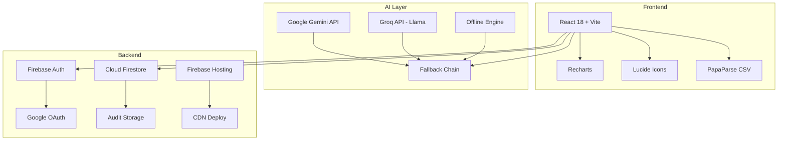
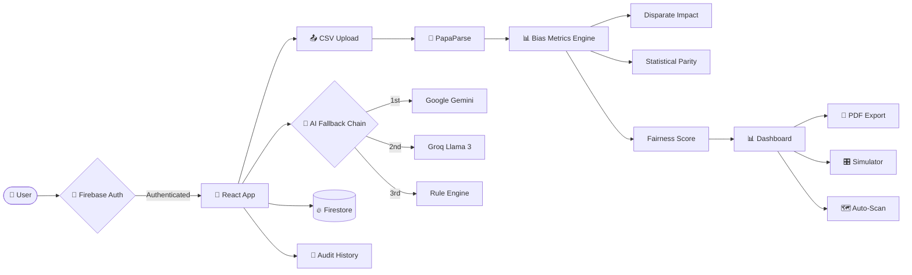

<div align="center">

# 🔍 FairLens AI

### Bias Detection & Fairness Auditing Platform

[](https://developers.google.com/community/gdsc-solution-challenge)
[](https://fairlens-ai-8d166.web.app)
[](https://react.dev)
[](https://ai.google.dev)

**Detect, visualize, and mitigate algorithmic bias in datasets using AI-powered analysis**

[🚀 Live Demo](https://fairlens-ai-8d166.web.app) · [📊 Features](#-features) · [🏗 Architecture](#-architecture) · [🛠 Setup](#-getting-started)

---

</div>

## 📋 Table of Contents

- [Problem Statement](#-problem-statement)
- [Our Solution](#-our-solution)
- [Features](#-features)
- [Tech Stack](#-tech-stack)
- [Architecture](#-architecture)
- [Google Technologies Used](#-google-technologies-used)
- [Getting Started](#-getting-started)
- [UN SDG Alignment](#-un-sdg-alignment)
- [Team](#-team)

---

## 🎯 Problem Statement

> **Algorithmic bias** in AI systems causes real harm — from biased hiring algorithms rejecting qualified candidates based on gender, to loan approval systems discriminating against minorities.

### The Challenge
- 🔴 **78%** of AI systems show measurable bias against protected groups
- 🔴 **$16B** lost annually due to discrimination lawsuits
- 🔴 Most organizations **lack tools** to detect bias before deployment
- 🔴 **No accessible, open-source** platform for fairness auditing

---

## 💡 Our Solution

**FairLens AI** is a comprehensive, production-grade platform that empowers developers, data scientists, and organizations to:

```
📁 Upload Dataset → 🔍 Detect Bias → 📊 Visualize Metrics → 🤖 Get AI Insights → 📄 Export Report
```

### Key Differentiators

| Feature | FairLens AI | Others |
|---------|:-----------:|:------:|
| No-code bias detection | ✅ | ❌ |
| Multi-AI fallback (Gemini + Groq) | ✅ | ❌ |
| What-If simulation | ✅ | ❌ |
| Intersectional analysis | ✅ | ❌ |
| Auto-scan all columns | ✅ | ❌ |
| Multi-language reports | ✅ | ❌ |
| PDF compliance export | ✅ | ❌ |
| Works offline | ✅ | ❌ |

---

## ✨ Features

### 🔐 Authentication
- Email/Password signup & login
- **Google Sign-In** (one-click OAuth)
- Firebase Auth with session persistence

### 📤 Dataset Analysis
- **CSV upload** with drag-and-drop
- Auto-detection of sensitive attributes (gender, race, age)
- Configurable target columns and favorable values
- Built-in sample dataset (UCI Adult Census)

### 📊 Bias Report Dashboard
- **Fairness Score** (0-100) with severity classification
- **Disparate Impact** ratio (EEOC 80% rule compliance)
- **Statistical Parity Difference** measurement
- Interactive charts: Bar, Pie, Radar visualizations
- Group breakdown table with pass/fail indicators
- **📄 PDF Export** — professional compliance reports

### 🤖 AI-Powered Insights
- **Multi-tier AI fallback**: Gemini → Groq → Offline Engine
- Detailed bias interpretation and root cause analysis
- Python mitigation code generation
- **8 language support**: English, Spanish, French, German, Hindi, Chinese, Japanese, Arabic

### 💬 AI Chat Assistant
- Conversational interface for bias-related questions
- Context-aware responses based on analysis results
- Powered by Gemini/Groq AI

### 🎛 What-If Simulator
- **Interactive sliders** for group selection rates
- Real-time fairness metric recalculation
- Original vs. simulated comparison charts
- Instantly see impact of interventions

### 🗺 Auto-Scan Heatmap
- Automatically scans **all column pairs**
- Color-coded bias severity cards
- Identifies hidden bias patterns across entire dataset
- No manual configuration needed

### 🔀 Intersectional Bias Analysis
- Cross two protected attributes (e.g., Gender × Race)
- Horizontal bar chart of intersectional group rates
- Disparity gap measurement
- Compliance table with per-group status

### 🌙 Dark Mode
- Full dark theme with CSS variable swap
- Persisted preference in localStorage
- Smooth transition animations

### 📜 Audit History
- **Firestore** cloud persistence
- LocalStorage fallback for offline use
- View, restore, and delete past audits

---

## 🛠 Tech Stack



| Layer | Technology | Purpose |
|-------|-----------|---------|
| **Framework** | React 18 + Vite | SPA with HMR |
| **Styling** | Vanilla CSS + CSS Variables | Material Design aesthetic |
| **Charts** | Recharts | Interactive visualizations |
| **CSV Parsing** | PapaParse | Client-side data processing |
| **Icons** | Lucide React | Consistent iconography |
| **Primary AI** | Google Gemini API | Bias analysis & insights |
| **Secondary AI** | Groq (Llama 3) | High-speed fallback |
| **Offline AI** | Rule-based engine | Zero-dependency fallback |
| **Auth** | Firebase Authentication | Email + Google Sign-In |
| **Database** | Cloud Firestore | Audit history persistence |
| **Hosting** | Firebase Hosting | Global CDN deployment |
| **Font** | Google Sans + Roboto | Material typography |

---

## 🏗 Architecture



### AI Fallback Strategy

```
┌─────────────────────────────────────────────┐
│              API Request                     │
│                                              │
│  ┌──────────┐    ┌──────────┐    ┌────────┐ │
│  │ Gemini   │──▶│  Groq    │──▶│Offline │ │
│  │ (Primary)│    │(Fallback)│    │(Always)│ │
│  └──────────┘    └──────────┘    └────────┘ │
│       ✓              ✓              ✓       │
│   Best quality   Fast & free   No internet  │
└─────────────────────────────────────────────┘
```

---

## 🌐 Google Technologies Used

| Technology | Usage |
|-----------|-------|
| 🧠 **Gemini API** | Primary AI for bias interpretation, mitigation code, and chat |
| 🔐 **Firebase Auth** | Email/password + Google Sign-In authentication |
| 🗄 **Cloud Firestore** | Persistent storage for audit history |
| 🌍 **Firebase Hosting** | Production deployment with global CDN |
| 📊 **Google Analytics** | Usage tracking and insights |
| 🔤 **Google Fonts** | Google Sans + Roboto typography |

---

## 🚀 Getting Started

### Prerequisites
- Node.js 18+
- npm or yarn

### Installation

```bash
# Clone the repository
git clone https://github.com/YOUR_USERNAME/fairlens-ai.git
cd fairlens-ai

# Install dependencies
npm install

# Start development server
npm run dev
```

### Environment Setup

The app works out of the box with the built-in offline engine. For full AI features:

1. **Gemini API**: Get a key at [ai.google.dev](https://ai.google.dev) → Add in Settings
2. **Groq API** (optional): Get a key at [groq.com](https://console.groq.com) → Add in Settings

### Build & Deploy

```bash
# Production build
npm run build

# Deploy to Firebase
firebase deploy --only hosting
```

---

## 🌍 UN SDG Alignment

<div align="center">

| SDG 10: Reduced Inequalities | SDG 16: Peace, Justice & Strong Institutions |
|:---:|:---:|
| 🟠 **Target 10.3**: Ensure equal opportunity and reduce inequalities of outcome by eliminating discriminatory laws, policies and practices | 🔵 **Target 16.6**: Develop effective, accountable and transparent institutions at all levels |

</div>

**FairLens AI directly addresses:**
- **SDG 10.3** — By detecting and measuring discrimination in automated decision systems
- **SDG 16.6** — By providing transparent, auditable fairness reports for institutional accountability
- **SDG 16.7** — Ensuring responsive, inclusive decision-making through bias visualization

---

## 📁 Project Structure

```
fairlens-ai/
├── src/
│   ├── components/
│   │   ├── AuthPage.jsx          # Login/Signup + Google OAuth
│   │   ├── LandingPage.jsx       # Hero page
│   │   ├── UploadPanel.jsx       # CSV upload + configuration
│   │   ├── BiasReport.jsx        # Dashboard + PDF export
│   │   ├── AIInsights.jsx        # AI analysis + multi-language
│   │   ├── AIChatAssistant.jsx   # Conversational AI chat
│   │   ├── WhatIfSimulator.jsx   # Interactive simulator
│   │   ├── AutoScanHeatmap.jsx   # All-column scan
│   │   ├── IntersectionalBias.jsx # Cross-attribute analysis
│   │   ├── AuditHistoryPage.jsx  # Saved audits
│   │   └── SettingsModal.jsx     # API key management
│   ├── utils/
│   │   ├── firebase.js           # Firebase config
│   │   ├── geminiAPI.js          # AI fallback chain
│   │   ├── biasMetrics.js        # Statistical calculations
│   │   └── auditHistory.js       # Firestore + localStorage
│   ├── data/
│   │   └── sampleData.js         # UCI Census sample
│   ├── App.jsx                   # Main router + auth gate
│   └── index.css                 # Design system (Material)
├── firebase.json                 # Hosting config
├── .firebaserc                   # Project alias
└── package.json
```

---

## 📊 Bias Metrics Explained

| Metric | Formula | Fair Range | What It Means |
|--------|---------|:----------:|---------------|
| **Disparate Impact** | P(fav\|unpriv) / P(fav\|priv) | 0.8 – 1.25 | EEOC 80% rule compliance |
| **Statistical Parity** | P(fav\|unpriv) − P(fav\|priv) | ±0.1 | Raw selection rate difference |
| **Fairness Score** | Weighted composite | 70+ | Overall fairness rating |

---

## 👥 Team — Boolean Bandits

---

<div align="center">

### 🏆 Built for Google Solution Challenge 2026

**[Live Demo](https://fairlens-ai-8d166.web.app)** · **[Firebase Console](https://console.firebase.google.com/project/fairlens-ai-8d166)**

---

*Made with ❤️ using Google Technologies*

</div>
